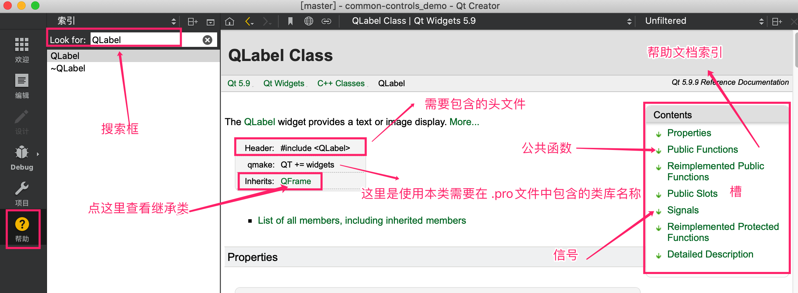
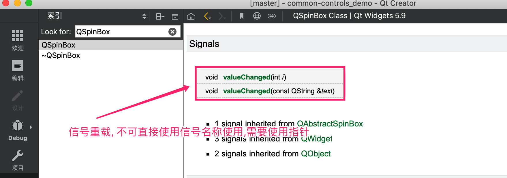
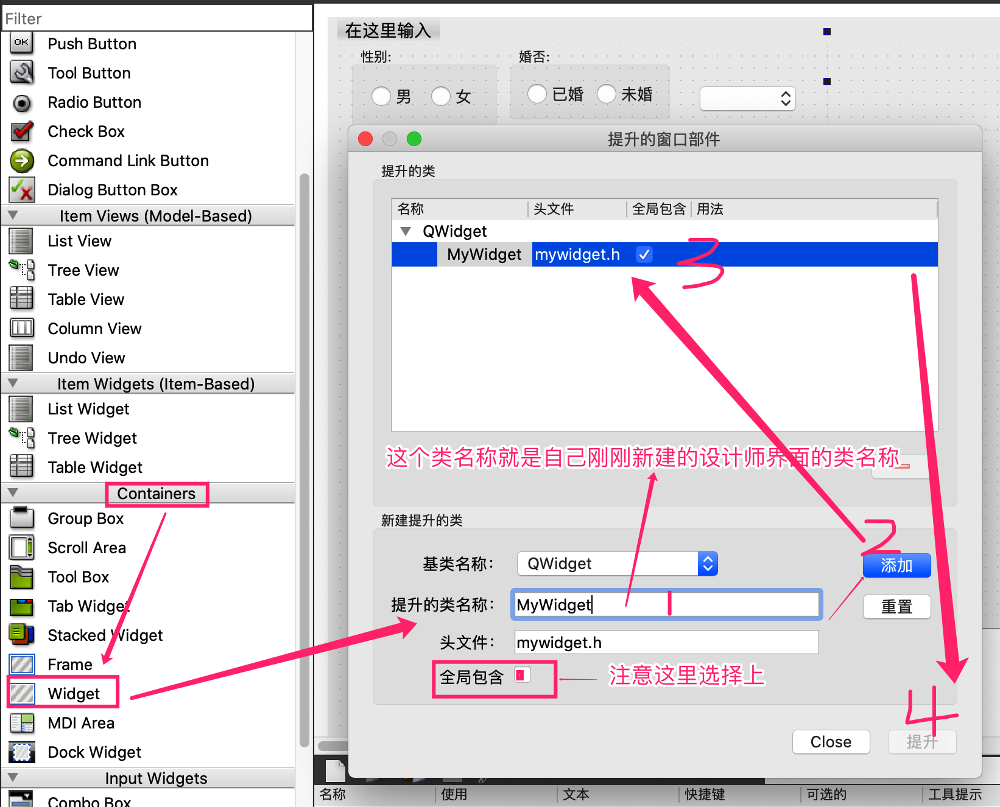

# QT常用控件演示 qt common controls demo
qt常用控件演示项目, JUST FOR LEARNING QT!

##QT 帮助文档查看方法

建议直接使用软件自带的帮助文档, 查找帮助文档的时候直接使用英文 搜索

找到相应的类后 先看  Contents 中的索引:

找方法: 依次查看 Public Functions, Public Slots, Protected Functions ,  Reimplemented Protected Functions ;  如果这些里面都没有找到, 可以到类的继承类中去查找,  查看继承类的方法直接点击 左侧的  Inherits: 后面的类名称即可

## 信号或者槽函数有重载的时候 需要使用指针

~~~cpp
 // spinbox的值改变,跟随改变进度条的值
    // 因为QSpinBox::valueChanged 这个信号有重载,所以这里必须使用指针, 指明我们要使用的是 void valueChanged(int i)
    void (QSpinBox::*sbptr)(int) = &QSpinBox::valueChanged;
    connect(ui->spinBox, sbptr,ui->horizontalSlider,&QSlider::setValue);

    // 进度条的值改变, 跟随改变spinbox的值; 这里的信号&QSlider::valueChanged 无重载,所以可以直接使用
    connect(ui->horizontalSlider,&QSlider::valueChanged,[=](int i){
        ui->spinBox->setValue(i);
    });

~~~

ps: connect 可使用常规模式,或者使用ladbda模式, 推荐使用lambda模式,

使用时 需要注意信号的形参

自定义控件 使用

1.   add new  --> QT-->设计师界面类;

2. 界面模板这里一般选择Widget :  注意这里的类型需要与你在容器中提升时的类型保存一致.

3. 新建完成后可双击 新建的.ui文件 对自定义控件进行编辑

4. 在其他界面中使用自定义控件:  先添加一个container的widget容器; 然后选择容器后  右键 -->提升到, 打开自定义控件提升页面, 录入自定义类名称,选择全局后,点击添加, 然后选择添加的类, 最后点击提升即可

   

### 自定义控件提供外部API接口

- mywidget.h

  ~~~mywidget.h
  public:
      explicit MyWidget(QWidget *parent = nullptr);
      ~MyWidget();
  //  自定义控件外部接口定义
      void mySetValue(int value);
      int myGetValue(void);
  
  
  ~~~

- mywidget.cpp

  ~~~mywidget.cpp
  #include "mywidget.h"
  #include "ui_mywidget.h"
  #include<QSpinBox>
  #include<QSlider>
  
  MyWidget::MyWidget(QWidget *parent) :
      QWidget(parent),
      ui(new Ui::MyWidget)
  {
      ui->setupUi(this);
  
      // spinbox的值改变,跟随改变进度条的值
      // 因为QSpinBox::valueChanged 这个信号有重载,所以这里必须使用指针, 指明我们要使用的是 void valueChanged(int i)
      void (QSpinBox::*sbptr)(int) = &QSpinBox::valueChanged;
      connect(ui->spinBox, sbptr,ui->horizontalSlider,&QSlider::setValue);
  
      // 进度条的值改变, 跟随改变spinbox的值; 这里的信号&QSlider::valueChanged 无重载,所以可以直接使用
      connect(ui->horizontalSlider,&QSlider::valueChanged,[=](int i){
          ui->spinBox->setValue(i);
      });
  
  }
  
  MyWidget::~MyWidget()
  {
      delete ui;
  }
  
  //MyWidget外部接口实现
  void MyWidget::mySetValue(int value)
  {
      // 设置进度条slider的值
      ui->horizontalSlider->setValue(value);
  }
  
  int MyWidget::myGetValue(void)
  {
      // 获取进度条的值
      return ui->horizontalSlider->value();
  }
  
  ~~~

- mainwindow.cpp

~~~mainwindow.cpp

    //通过自定义控件的自定义外部接口获取自定义控件的进度条的值
    connect(ui->pushButton_getApi, &QPushButton::clicked,[=](){
        qDebug()<<"进度条的值:"<< ui->widget->myGetValue();
    });

    connect(ui->pushButton_setApi,&QPushButton::clicked,[=](){
        ui->widget->mySetValue(99); // 通过自定义控件的api设置进度条的值
    });

~~~

## lambdas 演示

~~~cpp
#include <iostream>

using namespace std;

int main()
{

    /*
         * [capture list] (parameter list) ->return_value_type {function body}
         * */

    /*
     //Give lambda function a name and call it
    auto func = {
        cout << "Hello World!" << endl;
    };

    func();

    */

    /*
     *
     * //Call lambda function directly after definition
    {
            cout << "Hello World!" << endl;
        }();
     */

    /*
    //Define a lambda function that takes parameters

    {
        cout << " a + b = " << a + b <<endl;
    }(7,3);

    */

    /*
    //Define a lambda that returns something

    cout << "The sum is : " << ->int{
        return a + b;
    }(7,3) << endl;

    */

    /*
    //Capture Lists

    int a = 7;
    int b = 3;

    [a,b]()
    {
        cout << " a + b = " << a + b <<endl;
    }();
    */

    /*
    //Capturing by value

    int c = 42;

    auto func = [c](){
        cout << "The inner value of c is : " << c << endl;
    };

    for (int i = 1 ; i < 5 ; i++)
    {
        cout << "The outer value of c is : " << c << endl;
        func();
        c = c + 1;
    }

    */

    /*
    //Capturing by reference

    int c = 42;

    auto func = [&c](){
        cout << "The inner value of c is : " << c << endl;
    };

    for (int i = 1 ; i < 5 ; i++)
    {
        cout << "The outer value of c is : " << c << endl;
        func();
        c = c + 1;
    }

    */

    /*
    //Capture everything by by value
    int c = 42;
    int d = 6;

    auto func = [=](){
        cout << "The inner value of c is : " << c << endl;
        cout << "The inner value of d is : " << d << endl;
    };

    for (int i = 1 ; i < 5 ; i++)
    {
        cout << "The outer value of c is : " << c << endl;
        func();
        c = c + 1;
    }
    */

    int c = 42;
    int d = 6;

    auto func = [&](){
        cout << "The inner value of c is : " << c << endl;
        cout << "The inner value of d is : " << d << endl;
    };

    for (int i = 1 ; i < 5 ; i++)
    {
        cout << "The outer value of c is : " << c << endl;
        func();
        c = c + 1;
    }

    return 0;
}

~~~

### QGridLayout

~~~cpp
#include "widget.h"
#include "ui_widget.h"
#include <QGridLayout>

Widget::Widget(QWidget *parent) :
    QWidget(parent),
    ui(new Ui::Widget)
{
    ui->setupUi(this);

    //QGridLayout * layout = new QGridLayout(this);
    QGridLayout * layout = new QGridLayout();

    //First row
    layout->addWidget(ui->button1,0,0);
    layout->addWidget(ui->button2,0,1);
    layout->addWidget(ui->button3,0,2,2,1);

    //Second row
    layout->addWidget(ui->button4,1,0);
    layout->addWidget(ui->button5,1,1);

    //Third row
    layout->addWidget(ui->button7,2,0,1,2);
    layout->addWidget(ui->button9,2,2);

    setLayout(layout);
}

Widget::~Widget()
{
    delete ui;
}

~~~

### QCheckBoxRadioButtonDemo

~~~cpp
#include "widget.h"
#include "ui_widget.h"
#include  <QButtonGroup>
#include <QDebug>

Widget::Widget(QWidget *parent) :
    QWidget(parent),
    ui(new Ui::Widget)
{
    ui->setupUi(this);

    QButtonGroup * buttonGroup = new QButtonGroup(this);
    buttonGroup->addButton(ui->windowsCheckbox);
    buttonGroup->addButton(ui->macCheckBox);
    buttonGroup->addButton(ui->linuxCheckBox);

    buttonGroup->setExclusive(true);
}

Widget::~Widget()
{
    delete ui;
}

void Widget::on_windowsCheckbox_toggled(bool checked)
{
   if( checked)
   {
       qDebug() << "Windows Checkbox is checked";
   }else
   {
       qDebug() << "Windows Checkbox is unchecked";
   }
}

void Widget::on_beerCheckBox_toggled(bool checked)
{
    if( checked)
    {
        qDebug() << "Beer Checkbox is checked";
    }else
    {
        qDebug() << "Beer Checkbox is unchecked";
    }
}

void Widget::on_aRadioButton_toggled(bool checked)
{
    if( checked)
    {
        qDebug() << "A radiobutton  is checked";
    }else
    {
        qDebug() << "A radiobutton is unchecked";
    }
}

void Widget::on_grabData_clicked()

{
    if( ui->windowsCheckbox->isChecked())
    {
          qDebug() << "Windows Checkbox is checked";
    }else
    {
          qDebug() << "Windows Checkbox is unchecked";
    }

}

void Widget::on_setStateButton_clicked()
{
    //Exclusive
    if( ui->windowsCheckbox->isChecked())
    {
        ui->windowsCheckbox->setChecked(false);
    }else
    {
        ui->windowsCheckbox->setChecked(true);
    }

    //Non exclusive checkbox group
    if( ui->beerCheckBox->isChecked())
    {
        ui->beerCheckBox->setChecked(false);
    }else
    {
        ui->beerCheckBox->setChecked(true);
    }

}

~~~

### QList

~~~cpp
 //Declare the list
    QList<QString> stringList;

    //Put data in the list
    stringList << " I am " << " lovin " << " Qt";
    // [ "I am", " loving ", " Qt"]
    stringList.append(" a ");
    stringList.append( " lot !");

    //Get the data from the list
    qDebug() << "The first element is " << stringList[0];
    qDebug() << "The second element is " << stringList[1];
    qDebug() << "The third element is " << stringList[2];

    //Get the number of elements
    qDebug() <<  "The number of elements in my list is : " << stringList.count();

    //Loop through the elements
    for( int i = 0 ; i < stringList.count() ; i++)
    {
        qDebug() << "The element at index "<< QString::number(i) << " is " << stringList.at(i);
    }
~~~

### QMessageBox演示

~~~cpp
    QPushButton * button = new QPushButton(this);
    button->setText("Click Me");
    button->move(200,200);
    connect(button,&QPushButton::clicked,[=](){

        /*
        //The hard way
        QMessageBox message;
        message.setMinimumSize(300,200);
        message.setWindowTitle("Message Title");
        message.setText("Something happened");
        message.setInformativeText("Do you want to do something about it ?");
        message.setIcon(QMessageBox::Critical);
        message.setStandardButtons(QMessageBox::Ok | QMessageBox::Cancel);
        message.setDefaultButton(QMessageBox::Cancel);

        int ret = message.exec();
        */

        /*
        //Critical Message
        int ret = QMessageBox::critical(this,"Message Title","Something happened. Do you want to do something about it ?",
                                        QMessageBox::Ok | QMessageBox::Cancel);
        */

        /*
        //Information Message
        int ret = QMessageBox::information(this,"Message Title","Something happened. Do you want to do something about it ?",
                                        QMessageBox::Ok | QMessageBox::Cancel);
        */

        /*
        //Question
        int ret = QMessageBox::question(this,"Message Title","Something happened. Do you want to do something about it ?",
                                        QMessageBox::Ok | QMessageBox::Cancel);

        */

        //Warning message
        int ret = QMessageBox::warning(this,"Message Title","Something happened. Do you want to do something about it ?", QMessageBox::Ok | QMessageBox::Cancel);

        if ( ret == QMessageBox::Ok)
        {
            qDebug() << "User clicked on OK";
        }

        if ( ret == QMessageBox::Cancel)
        {
            qDebug() << "User clicked on Cancel";
        }

    });
~~~

### QVBoxLayout

~~~cpp
#include "widget.h"
#include "ui_widget.h"
#include <QDebug>
#include <QVBoxLayout>

Widget::Widget(QWidget *parent) :
    QWidget(parent),
    ui(new Ui::Widget)
{
    ui->setupUi(this);

    //Declare the widget
    QWidget * widget = new QWidget(this);

    //Declare the layout for the widget
    QVBoxLayout * layout = new QVBoxLayout();

    layout->addWidget(new QPushButton("Button1",this));
    layout->addWidget(new QPushButton("Button2",this));
    layout->addWidget(new QPushButton("Button3",this));
    QPushButton * button4 = new QPushButton("Button4",this);
    connect(button4,&QPushButton::clicked,[=](){
        qDebug() << "Button4 from custom tab clicked";
    });
    layout->addWidget(button4);
    layout->addSpacerItem(new QSpacerItem(100,200));

    //Set the layout to the widget
    widget->setLayout(layout);

    //Add the widget to the layout
    //ui->tabWidget->addTab(widget,"Tab 4");
    ui->tabWidget->insertTab(1,widget,"Tab 4");
}

Widget::~Widget()
{
    delete ui;
}

void Widget::on_tab1Button_clicked()
{
    qDebug() << "Tab1 button clicked";
}

~~~

## QListWidget

~~~cpp
#include "widget.h"
#include "ui_widget.h"
#include <QDebug>

Widget::Widget(QWidget *parent) :
    QWidget(parent),
    ui(new Ui::Widget)
{
    ui->setupUi(this);
    ui->listWidget->setSelectionMode(QAbstractItemView::MultiSelection);
}

Widget::~Widget()
{
    delete ui;
}

void Widget::on_addItemButton_clicked()
{
    ui->listWidget->addItem("MyItem");

}

void Widget::on_deleteItemButton_clicked()
{
    //Delete item : use takeItem
    ui->listWidget->takeItem(ui->listWidget->currentRow());
}

void Widget::on_selectedItemsButton_clicked()
{
    // Get the list of selected items
    QList<QListWidgetItem *> list =  ui->listWidget->selectedItems();

    for( int i = 0;  i < list.count(); i++)
    {
        qDebug() << "Selected item : " << list.at(i)->text() << " , row number id : "<<
                    ui->listWidget->row(list.at(i));

    }
}

~~~

### qt菜单栏

~~~cpp

#include "mainwindow.h"
#include "ui_mainwindow.h"
#include <QApplication>
#include <QDebug>
#include <QMessageBox>
#include <QTimer>

MainWindow::MainWindow(QWidget *parent) :
    QMainWindow(parent),
    ui(new Ui::MainWindow)
{
    ui->setupUi(this);
}

MainWindow::~MainWindow()
{
    delete ui;
}

void MainWindow::on_actionQuit_triggered()
{
    statusBar()->showMessage("App will be killed in 5 seconds...");
    QTimer::singleShot(5000,this,SLOT(quitApp()));

}

void MainWindow::on_actionCopy_triggered()
{
    ui->textEdit->copy();
}

void MainWindow::on_actionCut_triggered()
{
    ui->textEdit->cut();
}

void MainWindow::on_actionPaste_triggered()
{
    ui->textEdit->paste();
}

void MainWindow::on_actionUndo_triggered()
{
    ui->textEdit->undo();
}

void MainWindow::on_actionRedo_triggered()
{
    ui->textEdit->redo();
}

void MainWindow::on_actionAbout_triggered()
{
    QMessageBox::about(this,"Message","This is demo app to show how to use menus, toolbars and actions in Qt");
}

void MainWindow::on_actionAbout_Qt_triggered()
{
    QApplication::aboutQt();
}

void MainWindow::quitApp()
{
    QApplication::quit();
}

#include "mainwindow.h"
#include <QPushButton>
#include <QMenuBar>
#include <QStatusBar>
#include <QDebug>
#include <QAction>
#include <QApplication>

MainWindow::MainWindow(QWidget *parent)
    : QMainWindow(parent)
{

    //Add central widget
    QPushButton * button = new QPushButton("Hello",this);
    setCentralWidget(button);

    //Declare Quit Action
    QAction * quitAction = new QAction("Quit");
    connect(quitAction,&QAction::triggered,[=](){
        QApplication::quit();
    });

    //Add menus
    QMenu * fileMenu = menuBar()->addMenu("File");
    fileMenu->addAction(quitAction);
    menuBar()->addMenu("Edit");
    menuBar()->addMenu("Window");
    menuBar()->addMenu("Settings");
    menuBar()->addMenu("Help");

    //Add status bar message
    statusBar()->showMessage("Uploading file ...",3000);
    //statusBar()->clearMessage();

}

~~~

### QFileDialog

~~~cpp
#include "widget.h"
#include "ui_widget.h"
#include <QFileDialog>
#include <QDebug>

Widget::Widget(QWidget *parent) :
    QWidget(parent),
    ui(new Ui::Widget)
{
    ui->setupUi(this);
}

Widget::~Widget()
{
    delete ui;
}

void Widget::on_pushButton_clicked()
{

    /*
    //getExistingDirectory
    QString dir = QFileDialog::getExistingDirectory(this, tr("Open Directory"),
                                                      "/home",
                                                      QFileDialog::ShowDirsOnly
                                                      | QFileDialog::DontResolveSymlinks);

    qDebug() << "Your chosed dir is : " << dir;
    */

    /*
    //getOpenFileName
    QString fileName = QFileDialog::getOpenFileName(this, tr("Open File"),
                                                      "/home",
                                                      tr("Images (*.png *.xpm *.jpg)"));

    qDebug() << "Your chosed file is : " << fileName;
    */

    /*
    //getOpenFileNames
    QStringList files = QFileDialog::getOpenFileNames(
                              this,
                              "Select one or more files to open",
                              "/home",
                              "Images (*.png *.xpm *.jpg);;Text files (*.txt);;XML files (*.xml)");
    qDebug() << "Your chosed files are : " << files;
    */

    //getSaveFileName
    QString fileName = QFileDialog::getSaveFileName(this, tr("Save File"),
                                 "/home/jana/untitled.png",
                                 tr("Images (*.png *.xpm *.jpg)"));
    qDebug() << "Your chosen filename is  : " << fileName;

}

~~~

### QFontDialog

~~~cpp

void Widget::on_chooseFontButton_clicked()
{
    bool ok;
     QFont font = QFontDialog::getFont(
                     &ok, QFont("Helvetica [Cronyx]", 10), this);
     if (ok) {
         ui->label->setFont(font);

     } else {
         QMessageBox::information(this,"Message","User did not choose font");
     }

}

~~~

### QColorDialog

~~~cpp
#include "widget.h"
#include "ui_widget.h"
#include <QColorDialog>
#include <QFontDialog>
#include <QDebug>

Widget::Widget(QWidget *parent) :
    QWidget(parent),
    ui(new Ui::Widget)
{
    ui->setupUi(this);
    ui->label->setAutoFillBackground(true);
}

Widget::~Widget()
{
    delete ui;
}

void Widget::on_textColorButton_clicked()
{
    QPalette palette = ui->label->palette();

    QColor color = palette.color(QPalette::WindowText);

    QColor chosenColor = QColorDialog::getColor(color,this,"Choose text color");

    if(chosenColor.isValid())
    {
        palette.setColor(QPalette::WindowText,chosenColor);
        ui->label->setPalette(palette);
        qDebug() << "User choose a valid color";
    }else
    {
       qDebug() << "User choose a invalid color";
    }

}

void Widget::on_backgroundButton_clicked()
{

    QPalette palette = ui->label->palette();

    QColor color = palette.color(QPalette::Window);

    QColor chosenColor = QColorDialog::getColor(color,this,"Choose text color");

    if(chosenColor.isValid())
    {
        palette.setColor(QPalette::Window,chosenColor);
        ui->label->setPalette(palette);
        qDebug() << "User choose a valid color";
    }else
    {
       qDebug() << "User choose a invalid color";
    }
}

void Widget::on_fontButton_clicked()
{
    bool ok;
     QFont font = QFontDialog::getFont(
                     &ok, QFont("Helvetica [Cronyx]", 10), this);
     if (ok) {
        ui->label->setFont(font);
     } else {

     }

}

~~~

### QInputDialog

~~~cpp
#include "widget.h"
#include "ui_widget.h"
#include <QInputDialog>
#include <QDebug>

Widget::Widget(QWidget *parent) :
    QWidget(parent),
    ui(new Ui::Widget)
{
    ui->setupUi(this);
}

Widget::~Widget()
{
    delete ui;
}

void Widget::on_pushButton_clicked()
{

    /*
    bool ok;
    double d = QInputDialog::getDouble(this, tr("QInputDialog::getDouble()"),
                                            tr("Amount:"), 37.56, -10000, 10000, 2, &ok);
    if (ok)
    {
        qDebug() << "Your double value is " << QString::number(d);
    }
    */

    QStringList items;
          items << tr("Spring") << tr("Summer") << tr("Fall") << tr("Winter");

    bool ok;
    QString item = QInputDialog::getItem(this, tr("QInputDialog::getItem()"),
                                               tr("Season:"), items, 0, false, &ok);
    if (ok && !item.isEmpty())
    {
        qDebug() << "Your chosen item is "<< item;
    }

}

~~~

### QPalette

~~~cpp
#include "widget.h"
#include "ui_widget.h"
#include <QDebug>

Widget::Widget(QWidget *parent) :
    QWidget(parent),
    ui(new Ui::Widget)
{
    ui->setupUi(this);

    //Retrieve the palette for the label
    QPalette palette = ui->label->palette();

    //ui->label->setAutoFillBackground(true);

    //Modify the palette with our changes
    palette.setColor(QPalette::Window,Qt::blue);
    palette.setColor(QPalette::WindowText,Qt::red);

    //Reset the palette to the widget
    ui->label->setPalette(palette);
}

Widget::~Widget()
{
    delete ui;
}

void Widget::on_activeButton_clicked()
{
    QPalette::ColorGroup activeButtonColorGroup = ui->activeButton->palette().currentColorGroup();
    QPalette::ColorGroup disabledButtonColorGroup = ui->disabledButton->palette().currentColorGroup();

    qDebug() << " Active button color group  : " << activeButtonColorGroup;
    qDebug() << " Disabled button color group : " <<disabledButtonColorGroup;

}

~~~

### qt全局样式设置

main.cpp

~~~cpp
#include "widget.h"
#include <QApplication>
#include <QFile>
#include <QTextStream>

QString readTextFile(QString path)
{
    QFile file(path);

    if (file.open(QIODevice::ReadOnly | QIODevice::Text))
    {
        QTextStream in(&file);
        return in.readAll();
    }

    return "";
}

int main(int argc, char *argv[])
{
    QApplication a(argc, argv);

    QString css = readTextFile(":/styles/style.css");

    if( css.length() > 0)
    {
        a.setStyleSheet(css);
    }

    Widget w;
    w.show();

    return a.exec();
}
~~~

### QSettings 设置

  

~~~cpp
// widget.h

#ifndef WIDGET_H
#define WIDGET_H

#include <QWidget>
#include <QList>
#include <QColor>
#include <QPushButton>

namespace Ui {
class Widget;
}

class Widget : public QWidget
{
    Q_OBJECT

public:
    explicit Widget(QWidget *parent = 0);
    ~Widget();

private slots:
    void on_button1_clicked();

    void on_button2_clicked();

    void on_button3_clicked();

    void on_button4_clicked();

    void on_button5_clicked();

    void on_button6_clicked();

    void on_button7_clicked();

    void on_button8_clicked();

    void on_button9_clicked();

    void on_loadPushButton_clicked();

    void on_savePushButton_clicked();

private:
    Ui::Widget *ui;
    QList<QColor> colorList;

    void saveColor( QString key, QColor color);
    QColor loadColor(QString key);

    void setLoadedColor( QString key, int index, QPushButton * button);
};

#endif // WIDGET_H

//widget.cpp

#include "widget.h"
#include "ui_widget.h"
#include <QColorDialog>
#include <QSettings>

Widget::Widget(QWidget *parent) :
    QWidget(parent),
    ui(new Ui::Widget)
{
    ui->setupUi(this);

    for( int i =0 ; i < 9 ; i++)
    {
        colorList.append(Qt::black);
    }
}

Widget::~Widget()
{
    delete ui;
}

void Widget::on_button1_clicked()
{
    QColor color = QColorDialog::getColor(colorList[0],this,"Choose Background Color");
    if( color.isValid())
    {
        //Save the color in the list in memory
        colorList[0] = color;

        //Set background color to the button
        QString css = QString("background-color : %1").arg(color.name());
        ui->button1->setStyleSheet(css);
    }

}

void Widget::on_button2_clicked()
{
    QColor color = QColorDialog::getColor(colorList[1],this,"Choose Background Color");
    if( color.isValid())
    {
        //Save the color in the list in memory
        colorList[1] = color;

        //Set background color to the button
        QString css = QString("background-color : %1").arg(color.name());
        ui->button2->setStyleSheet(css);
    }

}

void Widget::on_button3_clicked()
{
    QColor color = QColorDialog::getColor(colorList[2],this,"Choose Background Color");
    if( color.isValid())
    {
        //Save the color in the list in memory
        colorList[2] = color;

        //Set background color to the button
        QString css = QString("background-color : %1").arg(color.name());
        ui->button3->setStyleSheet(css);
    }
}

void Widget::on_button4_clicked()
{
    QColor color = QColorDialog::getColor(colorList[3],this,"Choose Background Color");
    if( color.isValid())
    {
        //Save the color in the list in memory
        colorList[3] = color;

        //Set background color to the button
        QString css = QString("background-color : %1").arg(color.name());
        ui->button4->setStyleSheet(css);
    }

}

void Widget::on_button5_clicked()
{
    QColor color = QColorDialog::getColor(colorList[4],this,"Choose Background Color");
    if( color.isValid())
    {
        //Save the color in the list in memory
        colorList[4] = color;

        //Set background color to the button
        QString css = QString("background-color : %1").arg(color.name());
        ui->button5->setStyleSheet(css);
    }

}

void Widget::on_button6_clicked()
{
    QColor color = QColorDialog::getColor(colorList[5],this,"Choose Background Color");
    if( color.isValid())
    {
        //Save the color in the list in memory
        colorList[5] = color;

        //Set background color to the button
        QString css = QString("background-color : %1").arg(color.name());
        ui->button6->setStyleSheet(css);
    }
}

void Widget::on_button7_clicked()
{

    QColor color = QColorDialog::getColor(colorList[6],this,"Choose Background Color");
    if( color.isValid())
    {
        //Save the color in the list in memory
        colorList[6] = color;

        //Set background color to the button
        QString css = QString("background-color : %1").arg(color.name());
        ui->button7->setStyleSheet(css);
    }
}

void Widget::on_button8_clicked()
{

    QColor color = QColorDialog::getColor(colorList[7],this,"Choose Background Color");
    if( color.isValid())
    {
        //Save the color in the list in memory
        colorList[7] = color;

        //Set background color to the button
        QString css = QString("background-color : %1").arg(color.name());
        ui->button8->setStyleSheet(css);
    }
}

void Widget::on_button9_clicked()
{
    QColor color = QColorDialog::getColor(colorList[8],this,"Choose Background Color");
    if( color.isValid())
    {
        //Save the color in the list in memory
        colorList[8] = color;

        //Set background color to the button
        QString css = QString("background-color : %1").arg(color.name());
        ui->button9->setStyleSheet(css);
    }

}

void Widget::on_loadPushButton_clicked()
{
    setLoadedColor("button1",0,ui->button1);
    setLoadedColor("button2",1,ui->button2);
    setLoadedColor("button3",2,ui->button3);
    setLoadedColor("button4",3,ui->button4);
    setLoadedColor("button5",4,ui->button5);
    setLoadedColor("button6",5,ui->button6);
    setLoadedColor("button7",6,ui->button7);
    setLoadedColor("button8",7,ui->button8);
    setLoadedColor("button9",8,ui->button9);

}

void Widget::on_savePushButton_clicked()
{
    saveColor("button1",colorList[0]);
    saveColor("button2",colorList[1]);
    saveColor("button3",colorList[2]);
    saveColor("button4",colorList[3]);
    saveColor("button5",colorList[4]);
    saveColor("button6",colorList[5]);
    saveColor("button7",colorList[6]);
    saveColor("button8",colorList[7]);
    saveColor("button9",colorList[8]);

}

void Widget::saveColor(QString key, QColor color)
{
    int red = color.red();
    int green = color.green();
    int blue = color.blue();

    QSettings settings("Blikoon","SettingsDemo");

    settings.beginGroup("ButtonColor");
    settings.setValue(key + "r",red);
    settings.setValue(key + "g",green);
    settings.setValue(key + "b",blue);
    settings.endGroup();

}

QColor Widget::loadColor(QString key)
{
    int red;
    int green;
    int blue;
    QSettings settings("Blikoon","SettingsDemo");

    settings.beginGroup("ButtonColor");

    red = settings.value(key+"r",QVariant(0)).toInt();
    green = settings.value(key+"g",QVariant(0)).toInt();
    blue = settings.value(key+"b",QVariant(0)).toInt();
    settings.endGroup();

    return QColor(red,green,blue);
}

void Widget::setLoadedColor(QString key, int index, QPushButton *button)
{
    QColor color = loadColor(key);
    colorList[index] = color;
    QString css = QString("background-color : %1").arg(color.name());
    button->setStyleSheet(css);
}

~~~

### 文件读写

~~~cpp
#include "widget.h"
#include "ui_widget.h"
#include <QFile>
#include <QFileDialog>
#include <QTextStream>
#include <QMessageBox>

Widget::Widget(QWidget *parent) :
    QWidget(parent),
    ui(new Ui::Widget)
{
    ui->setupUi(this);
}

Widget::~Widget()
{
    delete ui;
}

void Widget::on_writeButton_clicked()
{

    //Save the file to disk
    QString filename = QFileDialog::getSaveFileName(this,"Save As");
    if( filename.isEmpty())
        return;

    QFile file(filename);

    //Open the file
    if( !file.open(QIODevice::WriteOnly | QIODevice::Text | QIODevice::Append))
        return;

    QTextStream out(&file);
    out << ui->textEdit->toPlainText() << "\n";

    file.close();
}

void Widget::on_readButton_clicked()
{

    QString  fileContent;
    //Save the file to disk
    QString filename = QFileDialog::getOpenFileName(this,"Open File");

    if(filename.isEmpty())
    return;

    QFile file(filename);
    if(!file.open(QIODevice::ReadOnly | QIODevice::Text))
        return;

    QTextStream in(&file);
    QString line = in.readLine();

    while(!line.isNull())
    {
         fileContent.append(line);
        line = in.readLine();
    }

    file.close();

    ui->textEdit->clear();
    ui->textEdit->setPlainText(fileContent);
}

void Widget::on_selectFileButton_clicked()
{
    QString filename = QFileDialog::getOpenFileName(this,"Choose File");
    if( filename.isEmpty())
        return;
    ui->sourceLineEdit->setText(filename);

}

void Widget::on_copyFileButton_clicked()
{
    QString srcFileName = ui->sourceLineEdit->text();
    QString destFileName = ui->destLineEdit->text();

    if( srcFileName.isEmpty() || destFileName.isEmpty())
        return;

    QFile file(srcFileName);
    if( file.copy(destFileName))
    {
        QMessageBox::information(this,"Success","Copy successful");
    }else
    {
        QMessageBox::information(this,"Failure","Copy Failed");
    }

}
~~~

### 目录 QFileDialog

~~~cpp
#include "widget.h"
#include "ui_widget.h"
#include <QFileDialog>
#include <QMessageBox>

Widget::Widget(QWidget *parent) :
    QWidget(parent),
    ui(new Ui::Widget)
{
    ui->setupUi(this);
}

Widget::~Widget()
{
    delete ui;
}

void Widget::on_chooseDirButton_clicked()
{
    QString filename = QFileDialog::getExistingDirectory(this,"Choose Folder");
    if( filename.isEmpty())
        return;
    ui->lineEdit->setText(filename);

}

void Widget::on_createDirButton_clicked()
{
    //Create a dir if it doesn't exist already
    QString dirPath = ui->lineEdit->text();
    if( dirPath.isEmpty())
        return;
    QDir dir(dirPath);
    if( !dir.exists())
    {
        //Create it

        if(dir.mkpath(dirPath))
        {
            QMessageBox::information(this,"Message","Directory created");
        }
    }else
    {
        QMessageBox::information(this,"Message","Directory already exists");
    }

}

void Widget::on_dirExistsButton_clicked()
{
    //Check if a directory exists
    QString dirPath = ui->lineEdit->text();
    if( dirPath.isEmpty())
        return;

    QDir dir(dirPath);
    if( dir.exists())
    {
        QMessageBox::information(this,"Message","Directory exists");
    }else
    {
        QMessageBox::information(this,"Message","Directory doesn't exist");
    }

}

void Widget::on_dirOrFileButton_clicked()
{
    QFileInfo fileInfo(ui->listWidget->currentItem()->text());
    if( fileInfo.isDir())
    {
        QMessageBox::information(this,"Message","This a Dir");
    }
    else if( fileInfo.isFile())
    {
        QMessageBox::information(this,"Message","This a File");
    }else
    {
       QMessageBox::information(this,"Message","Something else");
    }

}

void Widget::on_folderContentsButton_clicked()
{
    ui->listWidget->clear();

    QString dirPath = ui->lineEdit->text();
    if( dirPath.isEmpty())
        return;
    QDir dir(dirPath);

    //Get the list of files and directories in the folder

    QList<QFileInfo> fileList = dir.entryInfoList();

    for( int i = 0 ; i < fileList.size() ; i++)
    {
//        QString prefix;
//        if(fileList.at(i).isFile())
//        {
//            prefix = "FILE :";
//        }
//        if(fileList.at(i).isDir())
//        {
//            prefix = "DIRECTORY :";
//        }

        ui->listWidget->addItem(fileList.at(i).absoluteFilePath());
    }
}

~~~

